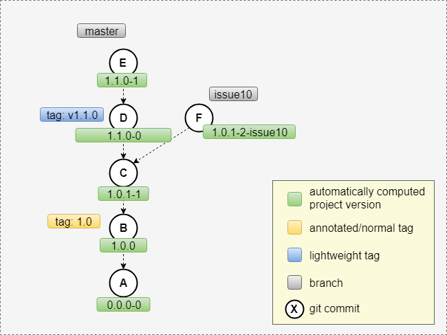

Welcome to this [jgitver](https://jgitver.github.io) gradle demo.

In this tutorial, you will see how to integrate [jgitver](https://jgitver.github.io) into a Gradle project.

[jgitver](https://jgitver.github.io) will allow automatic project version computation based 
on git information _(tags, commits, branches, ...)_

Without any modification in your `build.gradle` file, [jgitver](https://jgitver.github.io) will be able 
to compute automatically the `version` field of your project.  
 
Using the provided defaults you could obtain the following versions:

For now let's move to the next slide.
