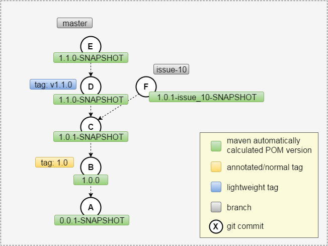

Welcome to this [jgitver](http://github.com/jgitver/jgitver) maven demo.

In this tutorial, you will see how to integrate [jgitver](http://github.com/jgitver/jgitver) into an existing maven project.

[jgitver](http://github.com/jgitver/jgitver) will allow automatic project version computation based 
on git information _(tags, commits, branches, ...)_
 

For now let's move to the next slide.
